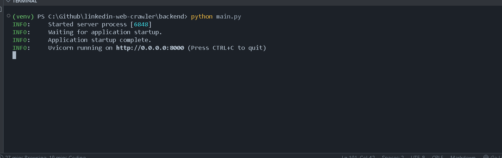

# LinkedIn Web Crawler

## Project Overview

The **LinkedIn Web Crawler** is a tool designed to extract publicly available data from LinkedIn profiles and company pages. It enables users to scrape information such as job titles, locations, summaries, and other key details from LinkedIn’s public-facing content. The crawler handles multiple URLs, supports pagination, and includes anti-bot measures to prevent blocking by LinkedIn’s anti-scraping mechanisms.

This project is divided into two main components:
1. **Backend**: Built using Python to perform the actual web crawling, data extraction, and output generation.
2. **Frontend**: A React-based interface that allows users to initiate crawls, view results, and navigate through the crawled data.

### Features:
- Crawl LinkedIn public profiles (e.g., individuals' profiles, company pages)
- Extract key details:
  - **Profiles**: Name, Job Title, Location, Summary/About Section
  - **Company Pages**: Company Name, Industry, Headquarters Location, Overview/About Section
- Pagination support to handle multiple pages of results
- Anti-bot mechanisms (headers, proxies, rate-limiting)
- Structured output in JSON format
- Simple web interface for managing crawl tasks and viewing results

## Project Structure

```
linkedin-crawler/
├── backend/
│   ├── app/
│   │   ├── __init__.py
│   │   ├── routes.py
│   │   ├── crawler.py
│   │   ├── utils.py
│   │   ├── credentials.py
│   ├── main.py
│   ├── requirements.txt
├── frontend/
│   ├── public/
│   ├── src/
│   │   ├── components/
│   │   ├── App.jsx
│   │   ├── index.jsx
│   ├── package.json
│   ├── vite.config.js
```

## Requirements

### Backend:
The backend is built using **Python**. Below are the required dependencies for both the backend and frontend:

**For Python:**
```bash
pip install -r backend/requirements.txt
```

**For Node.js (Frontend):**
```bash
npm install
```

## Getting Started

To run this project, you need to set up both the backend and the frontend.

### Step 1: Clone the Repository

```bash
git clone https://github.com/chuck-ankit/linkedin-web-crawler.git
cd linkedin-web-crawler
```

### Step 2: Set up the Backend

1. **Python Setup** (if using Python):
   - Install dependencies:
     ```bash
     pip install -r backend/requirements.txt
     ```
   - Navigate to the `backend/` folder and run the crawler script:
     ```bash
     python backend/crawler.py
     ```

### Step 3: Set up the Frontend

1. Navigate to the `frontend/` folder:
   ```bash
   cd frontend
   ```

2. Install the required frontend dependencies:
   ```bash
   npm install
   ```

3. Start the React development server:
   ```bash
   npm start
   ```

## Demo

### Below are some images demonstrating the features of the LinkedIn Web Crawler:

#### 1. **Frontend Interface:**
   - The main dashboard for managing crawl tasks and viewing results:
   .png)

#### 2. **Crawler in Action:**
   - A screenshot showing the crawling process and data extraction:
   


## License

This project is licensed under the MIT License - see the [LICENSE](LICENSE) file for details.

---


